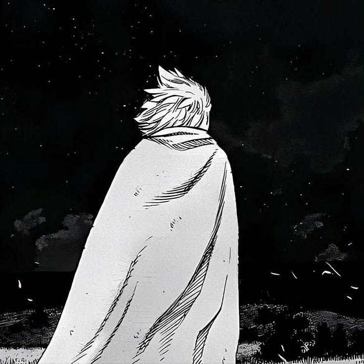

  
  <h1>afterfive</h1>
  <samp>BUILD · DESIGN · CREATE</samp>
    
  
Developer & creative builder. Turning ideas into applications, tools, and experiences.

  
  

---

<h2 align="center" id="about-me">About me</h2>

<table>
<tr>
<td width="68%">

I build <b>applications, Telegram bots, and agent tools</b>. I like working across disciplines — connecting code with design, motion, infrastructure, and marketing.

From the first sketch to deployment, I care about making ideas work in the real world. AI-assisted development is part of my process; reviewable changes and practical results are what matter.

Always learning. Always experimenting. <b>Open to interesting projects and collaborations.</b>

</td>
<td width="32%" align="center">

</td>
</tr>
</table>

<h2 align="center">Beyond code</h2>

Applications & Telegram bots 
Interface design & motion graphics 
Server operations & automation 
Product marketing & creative experiments

<h2 align="center" id="toolbox">Toolbox</h2>

---

<b>Have something worth building?</b> I'm interested in ambitious ideas and people who care about making them real.

<!-- Add a public Telegram or email link when supplied. -->
<samp>LEARNING. BUILDING. REFINING.</samp>

